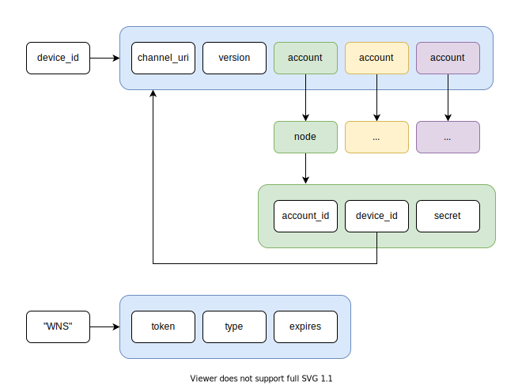

# UWPX-Push Server
This is the push server for the XMPP client [UWPX](https://github.com/UWPX/UWPX-Client).
I based my implementation roughly on the [Conversations Push Proxy](https://github.com/iNPUTmice/p2) by [@iNPUTmice](https://github.com/iNPUTmice).

## Terminology
 * `push server`: The [UWPX](https://github.com/UWPX/UWPX-Client) push server (this magic piece of software).
 * `user's XMPP server`: The XMPP server of the user.
 * `client`: The device running [UWPX](https://github.com/UWPX/UWPX-Client).

## Protocol
The following protocol is used to register and send [XEP-0357: Push Notifications](https://xmpp.org/extensions/xep-0357.html) to devices running [UWPX](https://github.com/UWPX/UWPX-Client).  
All of the following examples represent real world messages that have been send from and to test devices.

### Publishing the channel URI
During startup [UWPX](https://github.com/UWPX/UWPX-Client) will request a new [push notification channel](https://docs.microsoft.com/en-us/uwp/api/windows.networking.pushnotifications.pushnotificationchannelmanager.createpushnotificationchannelforapplicationasync#Windows_Networking_PushNotifications_PushNotificationChannelManager_CreatePushNotificationChannelForApplicationAsync) for the [Windows Push Notification Services (WNS)](https://docs.microsoft.com/en-us/windows/uwp/design/shell/tiles-and-notifications/windows-push-notification-services--wns--overview).  
On success [UWPX](https://github.com/UWPX/UWPX-Client) will receive a `channel_uri` which represents the Uniform Resource Identifier (URI) to which the push server sends push notification for the device.

This `channel_uri` will be send in combination with the `device_id` to this push server.

Hereby the `device_id` represents a unique hex string identifying the sender uniquely.
This is required to correlate all of the accounts for which a device wants to receive push notifications with the `channel_uri`.
Without this identifier, it wouldn't be possible to update/remove push channels from the server again.

#### Client -> Server
```JSON
{
	"version": 2,
	"action": "set_channel_uri",
	"device_id": "5486bd868050a620141f4e81c9f1d2c67ab0de27e5e26d218ca41c9394ee806b",
	"channel_uri": "ms-app://s-1-15-2-3598129719-3378870262-4208132049-182512184-2493220926-1891298429-4035237700"
}
```

#### Success: Server -> Client
```JSON
{
	"version": 2,
	"action": "response",
	"status": 1
}
```

#### Error: Server -> Client
```JSON
{
	"version": 2,
	"action": "response",
	"status": 0,
	"error": "Some error message e.g. Invalid JSON format."
}
```

### Update push accounts
The message has to include **all** account IDs for those, that should receive push notifications.
Once received by the server, it will replace all existing accounts with those.
This ensures, the client only receives notifications for those accounts, that are still active.  
Here the `account_id` should be a persistent per device unique value representing an account.
For privacy reasons, this `account_id` should **NOT** just simply be the bare JID of the account.
It's suggested to use the SHA256 hash of the `device_id` concatenated with the bare JID.

#### Client -> Server
```JSON
{
	"version": 2,
	"action": "set_accounts",
	"device_id": "5486bd868050a620141f4e81c9f1d2c67ab0de27e5e26d218ca41c9394ee806b",
	"accounts": [
		{
			"account_id": "DADBBB9327C711E4B626F7820FB299871D23D6020683BBD1E08D37E0246C7E90"
		},
		{
			"account_id": "16ECAB1875791E2B6ED0C9A6DAE5A12A79D92120E1C3AFBD3A9C8535CE44666D"
		}
	]
}
```

#### Success: Server -> Client
On success the server returns a success message, including a `node` and `secret` attribute for each account.
It also includes a `push_bare_jid` field, which represents the bare JID of the push server.
The `success` attribute indicates if creating a PubSub node was successful for the account.
```JSON
{
	"version": 2,
	"action": "response",
	"status": 1,
	"push_bare_jid": "push@xmpp.uwpx.org",
	"accounts": [
		{
			"account_id": "DADBBB9327C711E4B626F7820FB299871D23D6020683BBD1E08D37E0246C7E90",
			"node": "773bds9nf932",
			"secret": "sdf/82h)=1",
			"success": true
		},
		{
			"account_id": "16ECAB1875791E2B6ED0C9A6DAE5A12A79D92120E1C3AFBD3A9C8535CE44666D",
			"node": "8w3rn0MB3m38z2",
			"secret": "j$o909mN87!n/0m",
			"success": true
		}
	]
}
```

#### Error: Server -> Client
```JSON
{
	"version": 2,
	"action": "response",
	"status": 0,
	"error": "Some error message e.g. Invalid JSON format."
}
```

### Request a Test Push
Once an account has been registered, the client can request a test push message.
On success the server sends a test push message to the WNS, which then forwards it to the client.

#### Client -> Server
```JSON
{
	"version": 2,
	"action": "request_test_push",
	"device_id": "5486bd868050a620141f4e81c9f1d2c67ab0de27e5e26d218ca41c9394ee806b"
}
```

#### Success: Server -> Client
```JSON
{
	"version": 2,
	"action": "response",
	"status": 1
}
```

#### Success: Server -> Notification Server (WNS)
On success the push server also send a test push message to the (WNS) notification server which then forwards it to the client via the push channel.
```JSON
{
	"version": 2,
	"action": "test_push"
}
```

#### Error: Server -> Client
```JSON
{
	"version": 2,
	"action": "response",
	"status": 0,
	"error": "Some error message e.g. `device_id` not found."
}
```

## What the push server stores
The push server stores the following data persistent for up to seven days in a [Redis](https://redis.io/) key value store.



Here the `device_id` maps to the `channelUri`, protocol `version` and all `account`s related to this device.
An `account` is defined as the `SHA-256` hash of `device_id` concatenated with `_` and the `account_id`.
The `account` then maps to the corresponding `node` which then maps to the `account_id` received from the client, the `device_id` and the node `secret`.

Independent of that, the push server also maps the string `WNS` to the WNS related information like the token, its type and when it expires.

## What the app server sends via the WNS to the client
```JSON
{
    "version": 2,
    "account_id": "DADBBB9327C711E4B626F7820FB299871D23D6020683BBD1E08D37E0246C7E90",
	"message_count": 2,
	"pending_subscription_count": 0,
}
```
Since it is not allowed to encrypt the data send to the WNS, we do not simply forward the received message from the XMPP server ([reference](https://xmpp.org/extensions/xep-0357.html#publishing)). Instead we only send the `account_id` (published by the client during updating the push accounts) in combination with the message and pending subscription count.

## Dependencies
The UWPX push server depends on the following dependencies:

### Manual
To be able to build and run this server, you have to install the following dependencies on your own:
* [CMake](https://cmake.org/): `sudo dnf install cmake`
* [gcc](https://gcc.gnu.org/) or [clang](https://clang.llvm.org/) with support for `C++20`: `sudo dnf install gcc clang`
* [Conan](https://conan.io/): `pip3 install conan --user`
* [libstrophe dependencies](https://github.com/strophe/libstrophe#requirements): `sudo dnf install libxml2 openssl-devel expat autoconf automake libtool pkg-config`

#### Compressed
```
sudo dnf install cmake gcc clang binutils-devel libuuid-devel
sudo dnf install libxml2 openssl-devel expat autoconf automake libtool pkg-config
pip3 install conan --user 
```

### Automatic
The following dependencies will be installed automatically by [conan](https://conan.io/) during the CMake configuration phase.
* [nlohmann_json](https://github.com/nlohmann/json): JSON for Modern C++
* [glog](https://github.com/google/glog): The library provides logging APIs based on C++-style streams and various helper macros.
* [cpr](https://github.com/whoshuu/cpr): C++ Requests: Curl for People, a spiritual port of Python Requests.
* [redis-plus-plus](https://github.com/sewenew/redis-plus-plus): Redis client written in C++.
* [catch2](https://github.com/catchorg/Catch2): Catch2 is mainly a unit testing framework for C++, but it also provides basic micro-benchmarking features, and simple BDD macros.
* [CppServer](https://github.com/chronoxor/CppServer#requirements): Ultra fast and low latency asynchronous socket server & client C++ library with support TCP, SSL, UDP, HTTP, HTTPS, WebSocket protocols and 10K connections problem solution.
* [libsodium](https://libsodium.gitbook.io/doc/) Sodium is a modern, easy-to-use software library for encryption, decryption, signatures, password hashing and more.
* [libstrophe](https://strophe.im/libstrophe/) libstrophe is a minimal XMPP library written in C. 
* [ctre](https://github.com/hanickadot/compile-time-regular-expressions) Fast compile-time regular expressions with support for matching/searching/capturing during compile-time or runtime.
* [Date](https://github.com/HowardHinnant/date) A date and time library based on the C++11/14/17 <chrono> header.

### Prosody
The server currently only supports running in combination with a [Prosody](https://hg.prosody.im/) server.
To be able to use the server, the following configuration as to be performed:
* [mod_pubsub](https://prosody.im/doc/modules/mod_pubsub) has to be enabled.
* [mod_pep](https://prosody.im/doc/modules/mod_pep) has to be enabled.
* [mod_cloud_notify](https://modules.prosody.im/mod_cloud_notify) has to be installed and enabled.

#### Patching mod_pep
Since currently [mod_pep](https://prosody.im/doc/modules/mod_pep) does not play nicely with [mod_cloud_notify](https://modules.prosody.im/mod_cloud_notify) on prosody, you have to patch it:
```bash
nano /usr/lib/prosody/modules/mod_pep.lua # Or where you have installed prosody
```
Now replace the following lines. These are usually around line 53.
```lua
function is_item_stanza(item)
	return st.is_stanza(item) and item.attr.xmlns == xmlns_pubsub and item.name == "item" and #item.tags == 1;
end
```
with:
```lua
function is_item_stanza(item)
	-- return st.is_stanza(item) and item.attr.xmlns == xmlns_pubsub and item.name == "item" and #item.tags == 1;
	return true;
end
```
Now restart your prosody server and you should be ready to go.

## Building
```BASH
git clone https://github.com/UWPX/UWPX-Push-Server.git
cd UWPX-Push-Server
mkdir build
cd build
cmake ..
cmake --build .
```

## Configuration
The server expects a file called `configuration.json` to be located in the same directory, where you execute the server from.
If you run the server for the first time and there is no `configuration.json` present, it will create on with the following contents for you:
```JSON
{
    "db": {
        "url": "Uri to connect to the Redis server"
    },
    "tcp": {
        "port": 1997,
        "tls": {
            "serverCertPath": "Path to your 'domain.cert' file",
            "serverKeyPath": "Path to your 'domain.key' file"
        }
    },
    "wns": {
        "clientSecret": "The secret obtained from the Devcenter",
        "packetId": "The UWPX package ID starting with: 'ms-app://...'"
    },
    "xmpp": {
        "bareJid": "The bare JID of the push XMPP client (e.g. 'pushServer@xmpp.example.com')",
        "password": "The password for the push XMPP client",
        "port": 5222,
        "host": "The hostname of the XMPP server."
    }
}
```

## Execution
### Start
From the build direct you can execute the server as follows:
```BASH
./src/UWPX_Push_Server [--noInput] [--help] <PATH TO THE 'configuration.json' FILE>
--help - Display this help.
--noInput - Do not accept input. Exit via Ctrl+C. Useful when running headless.
```
In case no `configuration.json` file exist at the given location, the server will create an empty one, like described above.

### Stop
`q`
